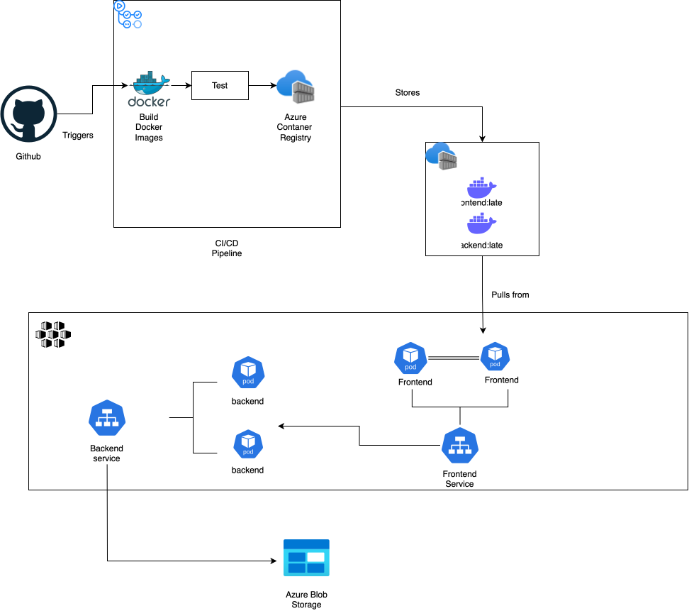
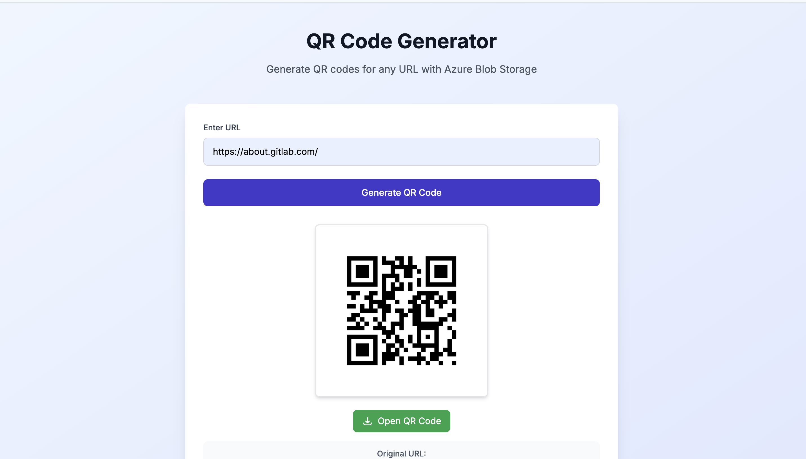
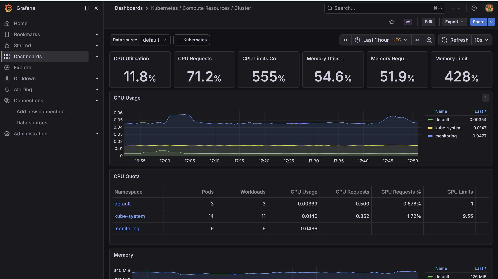
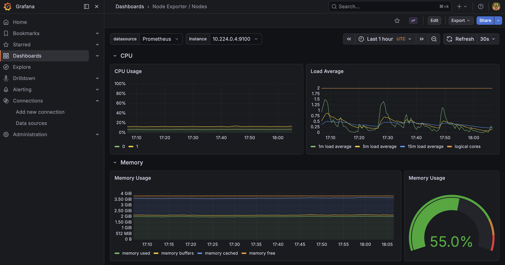
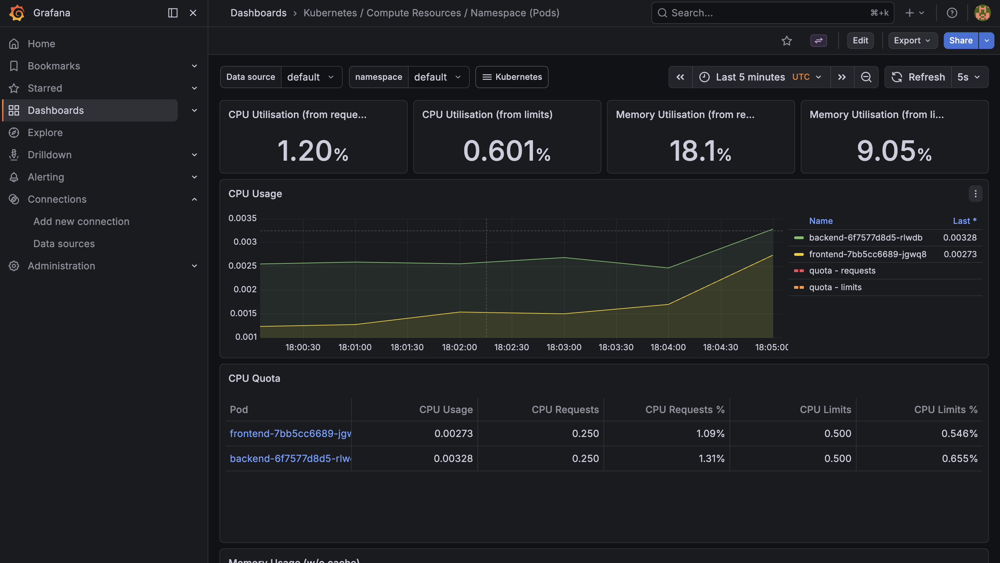
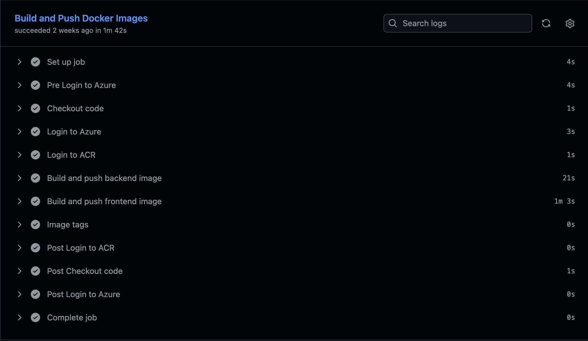
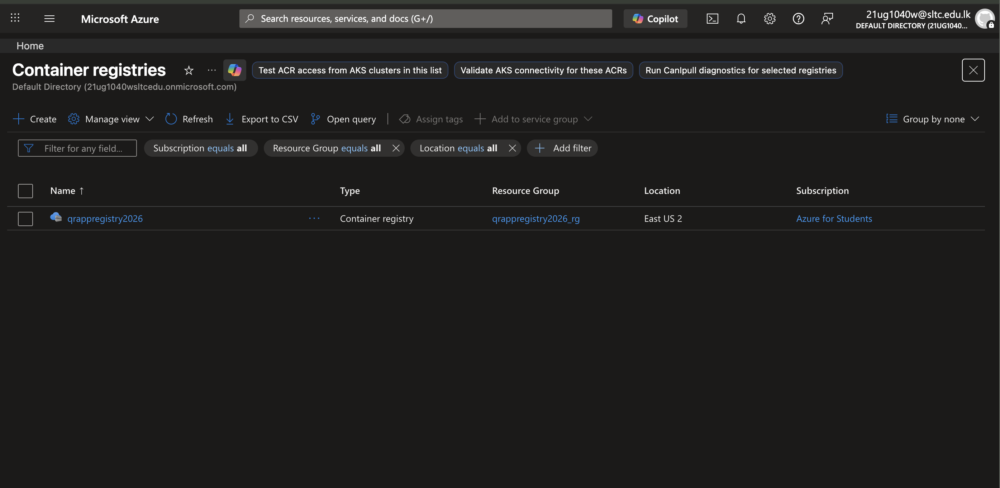
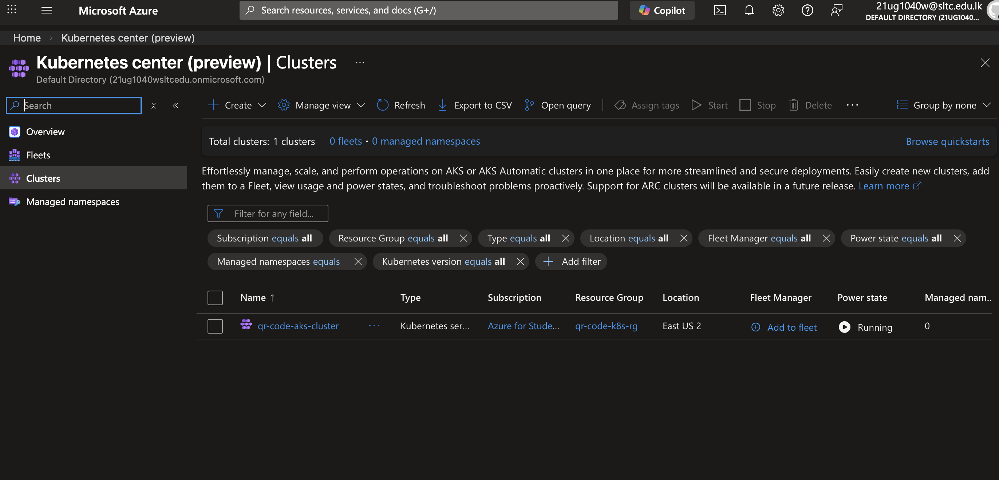

## 🎯 Project Overview

Full-stack QR code generator deployed on Azure Kubernetes Service with automated CI/CD, Infrastructure as Code, and monitoring.
**Live Demo:** http://20.22.157.60 (if still running)

## 📊 Architecture
High-Level Architecture:

## 🛠️ Technologies Used
**Frontend:** Next.js, React, Tailwind CSS 
**Backend:** FastAPI, Python, qrcode, azure-storage-blob 
**Infrastructure:** Azure Kubernetes Service (AKS), Terraform 
**CI/CD:** GitHub Actions 
**Monitoring:** Prometheus, Grafana 
**Container Registry:** Azure Container Registry 
**Storage:** Azure Blob Storage

## ✨ Key Features
- ✅ Automated CI/CD pipeline (build, test, deploy) 
- ✅ Infrastructure as Code with Terraform 
- ✅ Kubernetes orchestration with high availability 
- ✅ Real-time monitoring with Prometheus & Grafana 
- ✅ Microservices architecture 
- ✅ Cloud-native design 
- ✅ Cost-optimized ($10/month with destroy strategy)
## 🚀 What I Learned
- Containerization with Docker 
- Kubernetes orchestration 
- Azure cloud services 
- CI/CD automation 
- Infrastructure as Code 
- Monitoring and observability 
- Cost optimization strategies
## 📈 Monitoring
20+ pre-built dashboards showing: 
- Real-time CPU/memory usage 
- Request rates and latencies 
- Pod health status 
- Historical trends
## 💰 Cost Management
Implemented cost optimization: 
- Terraform destroy strategy: ~$10/month 
- Resource limits and quotas 
- Auto-scaling disabled for predictable costs
## 📸 Screenshots
- Application UI 

- Grafana dashboards 

- GitHub Actions pipeline 

- Azure Portal resources

